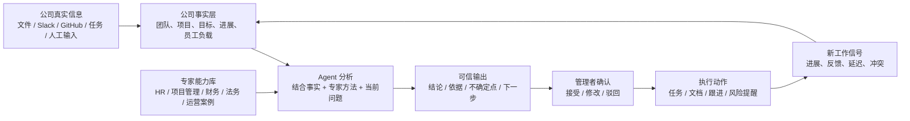
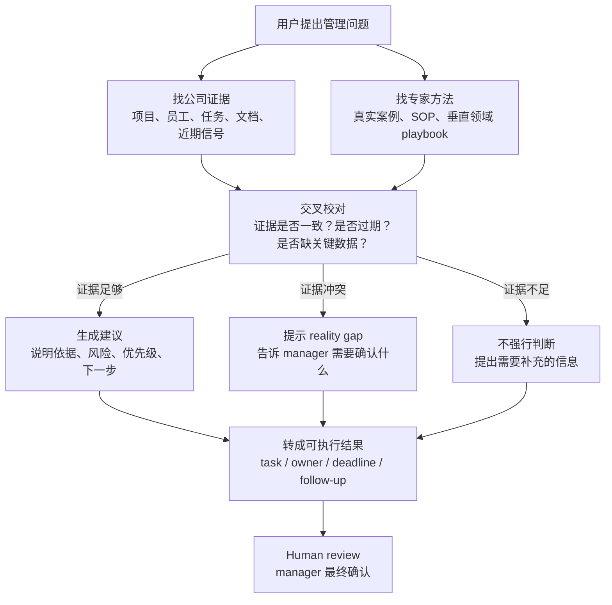

[[补充：自动实时更新 - 让 agent 的判断跟上公司现实]]


**teamMaster Agent 可信产出技术思维报告 v0.2**

**核心判断**

teamMaster 要解决的问题不是“让 AI 更会聊天”，而是让 AI 在公司真实信息、专家方法论和管理者校对之间形成闭环。

可信度来自三件事：

1. **知道公司真实发生了什么**  
   来自文件、项目进展、任务、Slack/GitHub 等工作信号，以及管理者手动补充的信息。

2. **知道应该如何判断这些信息**  
   来自公司人工提供或 teamMaster 内置的专家垂直领域 capabilities RAG，比如 HR、项目管理、财务、法务、运营、销售管理中的真实解决方案、业务案例和标准流程。

3. **知道什么时候不能直接下结论**  
   对证据不足、数据冲突、敏感决策，agent 应该提示“需要确认”，而不是强行生成看似专业的建议。

换句话说，teamMaster 的 agent 不是凭空给建议，而是把：

```text
公司事实 + 专家经验 + 管理目标 + 当前信号
```

合成一份可追溯、可校对、可执行的管理建议。

---

**1. 可行性说明：为什么这个方向可行**

**1.1 数据不是一次性上传，而是持续形成公司事实层**

公司管理判断最大的风险，是信息分散在聊天、文档、会议、任务系统、员工口头汇报里。teamMaster 的第一层能力，是把这些信息变成统一的公司事实层。

这层事实包括：

- 公司是谁：业务模式、团队结构、目标、关键客户、当前阶段。
- 项目在做什么：负责人、目标、截止时间、当前状态、风险。
- 员工在承担什么：角色、任务、协作关系、历史贡献、近期负载。
- 最近发生了什么：进度更新、任务变化、异常延迟、沟通减少、重复 blocker。
- 管理者明确说过什么：优先级、判断、例外情况、战略偏好。

这不是让 AI 自己“理解公司”，而是先把公司信息组织成一个可查询、可更新、可校对的事实系统。

**1.2 专家垂直领域 capabilities RAG 是可信建议的第二条腿**

只知道公司事实还不够。一个 agent 即使知道“某项目延期了”，也未必知道应该如何处理。

所以 teamMaster 需要有一层 **专家能力库**，也就是 capabilities RAG。它不是普通文档搜索，而是从真实解决方案和业务案例中提炼出来的“判断框架”和“处理方法”。

例子：

- HR capability：如何判断员工负载异常、协作断层、绩效风险。
- Project Ops capability：如何处理延期、scope creep、跨团队依赖阻塞。
- Finance capability：如何判断预算消耗、现金流压力、ROI 优先级。
- Legal capability：哪些建议只能提示风险，不能替代法律意见。
- Sales / Customer capability：如何识别客户流失风险、续约风险、交付风险。
- Founder / CEO capability：如何做优先级取舍、组织节奏管理、关键人风险管理。

这样 agent 的建议来源就不是“模型常识”，而是：

```text
当前公司证据
+
被整理过的专家经验
+
适合公司阶段的管理动作
```

这点在 presentation 里很重要。它可以解释为什么 teamMaster 的建议会比普通 ChatGPT 更贴近实际：普通 ChatGPT 只有泛化知识，teamMaster 有公司上下文和垂直管理方法论。

**1.3 Agent 不直接相信单一信息源，而是做交叉校对**

一个可靠的管理 agent 不能只看员工自报，也不能只看 GitHub commit，更不能只看 Slack 活跃度。

它应该把多个信号放在一起看：

```text
员工说进展正常
但任务没有更新
Slack 讨论减少
GitHub 没有相关提交
同项目其他成员反复提到 blocker
```

这时 agent 不应该说“员工表现不好”，而应该说：

```text
这里出现了 report mismatch。
目前证据显示：自报进展和实际工作信号不一致。
建议 manager 先确认 blocker、优先级变化或任务拆分是否不清楚。
```

这就是可信性的关键：agent 不做人身判断，只指出证据之间的矛盾，并给出低风险的下一步动作。

**1.4 有效的 agent orchestration 应该像一个管理分析流程**

teamMaster 不应该让一个 agent 从头到尾自由发挥，而应该拆成稳定流程：

```text
理解问题
→ 找公司上下文
→ 找专家能力库
→ 找近期信号
→ 检查证据是否冲突
→ 生成建议
→ 标注依据和置信度
→ 转成任务或 follow-up
→ 等待用户确认
```

低风险请求可以直接回答，例如总结项目状态、生成任务列表、整理会议 follow-up。

高风险请求需要更严格：

- 涉及员工评价：只能基于行为和工作信号，不能做人格判断。
- 涉及法律/财务：只能做风险提示和准备清单，不能当最终专业意见。
- 涉及裁员、降薪、绩效处分：必须 human review。
- 数据不足：必须说“目前不能可靠判断”。

**1.5 可信输出的格式要固定**

agent 的输出最好不是一段漂亮长文，而是固定结构：

```text
结论
依据
不确定点
建议动作
需要谁确认
下一步任务
```

这样 manager 才能快速判断：这条建议是能执行，还是只是 AI 说得像那么回事。

---

**2. Prototype 中已经实践的方向：翻译成人话**

当前 prototype 不能作为“成熟系统”的证明，大部分代码也不适合拿去讲。但它可以说明：teamMaster 已经在正确方向上做了早期探索。

可以这样讲：

**2.1 已经不是单纯聊天机器人**

prototype 里已经尝试让用户上传公司资料、项目资料、团队资料，再由系统整理成可被 agent 使用的上下文。

人话表达：

```text
我们不是让用户每次从零解释公司背景，而是让系统先建立一份公司上下文。
后续 agent 回答问题时，会围绕这份上下文工作。
```

**2.2 已经有 External Brain 的雏形**

用户上传的文档不会只作为附件丢给模型，而是被拆分、索引、分类，后续问题可以按相关性取回。

人话表达：

```text
公司资料会变成一个可查询的知识库。
agent 回答时，不需要凭记忆猜，而是先找相关资料，再结合问题回答。
```

**2.3 已经有“不同问题走不同知识模块”的思路**

prototype 里已经有初步的 routing：不同问题会匹配不同知识模块，而不是所有问题都用同一种上下文。

人话表达：

```text
问项目风险，就优先看项目和进度信号。
问员工负载，就优先看任务、协作和近期工作信号。
问战略优先级，就优先看公司目标和资源约束。
```

**2.4 已经有管理信号和风险检测的雏形**

prototype 里已经开始考虑 signals：任务、汇报、进展、协作异常等信息，可以形成 reality gap。

人话表达：

```text
teamMaster 不只听人怎么说，也看工作系统里发生了什么。
当“汇报”和“实际信号”不一致时，它会提醒 manager 做确认。
```

**2.5 已经有从建议到执行的雏形**

agent 不是只输出文字建议，也可以生成 todo、doc、chart、task 等 artifact。

人话表达：

```text
我们希望 agent 的最终结果不是一段建议，而是可以直接进入执行的东西：
任务、负责人、截止时间、跟进问题、项目状态更新。
```

这部分答辩时不用讲代码文件名。讲成“prototype 已经验证了几个产品方向”：公司上下文、知识库检索、信号判断、artifact 输出、任务转化。

---

**3. 增长与执行路线**

**3.1 第一阶段：让 manager 愿意信**

目标不是自动化所有管理，而是让 manager 感觉：

```text
这个 agent 说得有依据。
它知道哪些地方不确定。
它给的是我可以执行的下一步。
```

重点能力：

- 公司 onboarding：建立公司画像、团队结构、项目目标。
- External Brain：上传公司文档、项目资料、业务案例。
- 专家 capabilities RAG：导入垂直领域 playbook。
- Nexus agent：回答管理问题，生成建议和任务。
- Review-before-commit：重要结论先给 manager 确认。

**3.2 第二阶段：接入真实工作流**

优先接入：

- Slack：沟通、汇报、协作异常、项目讨论。
- GitHub：工程进度、commit、PR、review、交付节奏。
- Google Drive / Notion / Confluence：长期文档和项目资料。
- Jira / Linear：任务状态、延期、owner、blocker。

Slack 是最重要的早期 connector，因为它最接近日常真实管理信息。但 Slack message 不能直接等同于员工表现，只能作为工作信号之一。

**3.3 第三阶段：从“回答问题”到“管理闭环”**

最终闭环应该是：

```text
新信息进入
→ 系统更新公司事实
→ agent 发现风险或机会
→ manager 确认判断
→ 生成任务
→ 执行产生新信号
→ 下一轮分析更准确
```

这就是 teamMaster 和普通 AI 助手的区别：普通 AI 是一次性回答，teamMaster 是持续管理系统。

---

**4. 成本和要求**

下面成本是基于 2026-06-01 查询到的官方资料和粗略估算；价格会变，我不把它当固定报价。

**4.1 Slack 成本**

Slack API 本身通常不是按 API call 单独收费，主要成本来自客户使用的 Slack plan 和 API 限制。

关键点：

- Slack Free 有 90 天消息历史和 app 数量限制。
- 真正用于公司长期管理，通常需要付费 Slack，因为 teamMaster 需要历史消息和完整工作上下文。
- Slack Web API 是 per method、per workspace、per minute rate limit。
- Slack Events API 官方限制是每 workspace/team、每 app、每 60 分钟最多 30,000 events。
- 所以技术策略应该是：Events API 做增量同步，Web API 做少量补查和历史 backfill。

**4.2 模型最低要求**

teamMaster 不一定必须绑定某一家模型，但最低需要这些能力：

- 支持长上下文，至少能处理公司摘要 + evidence pack + 专家 playbook。
- 支持稳定 JSON / structured output。
- 支持 tool calling 或等价机制。
- 支持 streaming，用户体验更好。
- 成本足够低，可以承受日常频繁使用。
- 对高风险问题能切换到 reasoning model 或二阶段审查。

简单说：

```text
普通任务：便宜、快、稳定的 chat model。
高风险判断：reasoning model 或多步校对。
知识库：embedding model。
```

**4.3 LLM 成本粗估**

DeepSeek 官方页面当前显示：

- `deepseek-chat`：cache hit input `$0.07 / 1M tokens`，cache miss input `$0.27 / 1M tokens`，output `$1.10 / 1M tokens`。
- `deepseek-reasoner`：cache hit input `$0.14 / 1M tokens`，cache miss input `$0.55 / 1M tokens`，output `$2.19 / 1M tokens`。

阿里云 Model Studio 国际价格页面当前显示：

- `qwen-plus` 在较小上下文档位有 input `$0.115 / 1M tokens`，非 thinking output `$0.287 / 1M tokens`，thinking output `$1.147 / 1M tokens`。
- `text-embedding-v4` 国际价格约 `$0.07 / 1M input tokens`。

一个 manager 日常使用的粗略估算：

```text
每天 20 次 agent 对话
每次平均 6K input + 1K output
再加 routing、memory、summary 等后台调用
```

使用低成本 chat model，可能是每个 active manager 每月几美元级别。  
如果大量请求都走 reasoning model，成本会明显上升，但仍然可以通过缓存、摘要、分层 retrieval 控制。

**4.4 全天候同步的 token 损耗**

关键原则：

```text
不要每条 Slack message 都调用 LLM。
```

正确做法是：

- 原始消息先存储。
- 简单规则先过滤。
- 短消息批量 embedding。
- 只有出现异常、聚合总结、manager 查询时，才调用 LLM。
- 每日/每项目/每员工做 compact summary，避免重复处理全部历史。

所以全天候同步的主要成本不是“接收信息”，而是：

```text
embedding + 批量摘要 + 异常触发分析
```

对于早期 20-100 人团队，如果设计正确，token 成本应该可控。真正会烧钱的是把所有消息逐条送进大模型分析，这个方案不应该采用。

---

**5. 简化图 1：任何人能看懂的产品流程**



**6. 简化图 2：agent 为什么可信**



**7. 一句话答辩版本**

teamMaster 的可信性不来自模型自己变聪明，而来自一个可审计的管理闭环：它先整理公司真实事实，再调用专家垂直能力库，用多源信号校对风险，最后把建议变成可由 manager 确认和执行的任务。AI 负责发现模式、组织证据和提出下一步，人仍然负责关键判断。

**Sources**

- [Slack pricing](https://slack.com/pricing)
- [Slack Web API rate limits](https://api.slack.com/apis/rate-limits)
- [Slack Events API](https://docs.slack.dev/apis/events-api/)
- [DeepSeek API pricing](https://api-docs.deepseek.com/quick_start/pricing-details-usd)
- [Alibaba Cloud Model Studio pricing](https://www.alibabacloud.com/help/en/model-studio/model-pricing)