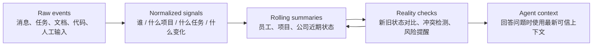
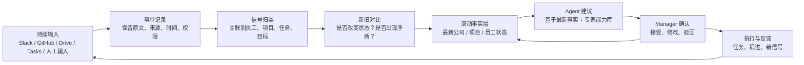

[[Prototype 2.0 和 demo 需要的资料总汇.canvas]]
[[可信产出技术思维报告 v0.2]]


teamMaster 的可信性不只来自初始化时上传的资料，更来自它能持续吸收公司每天发生的新信息，并不断校对旧判断。

真正的公司状态不是静态文档，而是每天变化的：

```text
Slack 里有人反馈 blocker
GitHub 里 PR 卡住
Linear/Jira 里任务延期
Google Drive 里方案被更新
manager 手动修改优先级
员工汇报和实际进展不一致
```

如果 agent 只依赖 onboarding 时的资料，它很快就会过期。所以 teamMaster 需要一个持续更新机制。

**3.1 实时输入不是直接喂给大模型**

日常输入会非常多，不能每条消息都让 LLM 分析。正确流程应该是：

```text
新输入进入
→ 先存 raw event
→ 去重、归类、打时间戳
→ 关联到人 / 项目 / 任务 / 客户
→ 只在必要时触发 embedding、summary 或 risk check
→ 更新公司事实层和近期信号
```

这样可以同时保证三件事：

- 不丢失原始证据。
- 不让 token 成本失控。
- 不让 agent 被单条噪音消息带偏。

**3.2 系统需要持续做校对和对比**

teamMaster 应该把新信息和已有判断不断对比：

```text
旧状态：项目 A 本周应完成设计评审
新信号：Slack 里连续两天讨论 blocker，GitHub 没有相关 PR
系统判断：项目状态可能已从 on track 变成 at risk
```

再比如：

```text
旧状态：员工 B 工作负载正常
新信号：过去 3 天任务更新减少，但 Slack 中多次被其他人 @ 处理紧急问题
系统判断：不是简单低产出，可能是被临时支持工作打断
```

这种对比比“实时总结 Slack”更重要。它让 agent 能发现变化、矛盾和风险，而不是只做聊天记录摘要。

**3.3 自动更新应该分三层**



- **Raw events**：保留原始输入，方便追溯。
- **Normalized signals**：把不同系统的信息变成统一格式。
- **Rolling summaries**：按项目、员工、公司维度持续压缩。
- **Reality checks**：检查新信号是否推翻旧判断。
- **Agent context**：用户提问时，agent 看到的是最新整理后的上下文，而不是旧资料。

**3.4 更新不是覆盖，而是带时间线的版本变化**

可信系统不能简单把旧信息覆盖掉。它要知道：

```text
上周项目状态是什么？
为什么这周变成 at risk？
是谁提供了新信息？
哪些证据支持这个变化？
manager 是否确认过？
```

所以 teamMaster 的更新方式应该是时间线式的：

```text
Project status v1: on track
Evidence: Monday standup + task completion

Project status v2: at risk
Evidence: delayed PR + repeated blocker + missing dependency

Manager review: confirmed / edited / dismissed
```

这能让投资人理解：teamMaster 不是黑箱 AI，而是一个持续记录判断依据的系统。

**3.5 自动同步也要有“冷静机制”**

不是所有新输入都应该立刻改变结论。否则系统会被噪音带偏。

需要几个控制：

- **Recency weighting**：新信息更重要，但不能完全覆盖长期趋势。
- **Source reliability**：manager 确认的信息权重高于普通聊天片段。
- **Evidence threshold**：单条消息不触发严重风险，多个信号叠加才触发。
- **Conflict detection**：冲突时不自动下结论，而是提示 manager。
- **Cooldown**：避免同一个风险每小时重复提醒。
- **Human confirmation**：关键状态变化需要 manager 确认后进入长期事实层。

**3.6 这对 agent 输出的影响**

有了实时更新和校对，agent 回答不再是：

```text
根据你上传的资料，我建议……
```

而是：

```text
根据当前项目资料、过去 7 天任务更新、Slack 中的 blocker 讨论，以及昨天 manager 修改的优先级，我认为项目 A 现在是 medium risk。主要原因是 dependency X 没有 owner。建议今天先确认 owner，而不是继续扩大 scope。
```

这就是“贴合实际情况”的来源。

**可以替换原报告里的核心闭环图**



这一节建议放在“可行性说明”之后，“Prototype 实践”之前。它能补上最关键的问题：teamMaster 不是静态 RAG，而是持续更新、持续校对的管理系统。